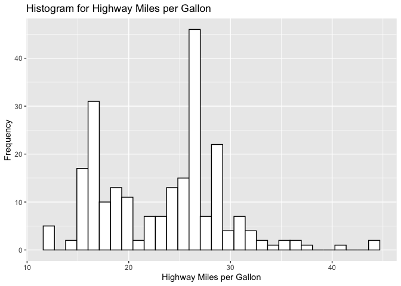
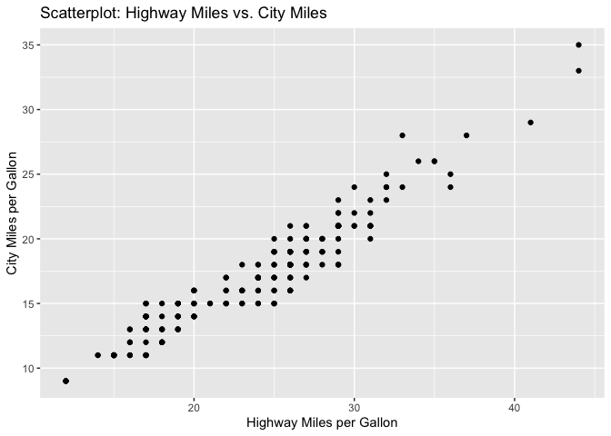
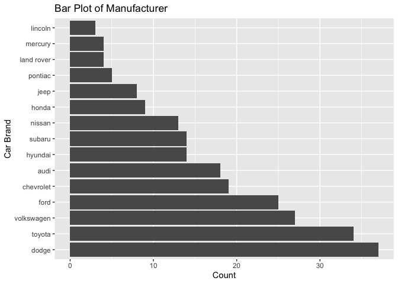
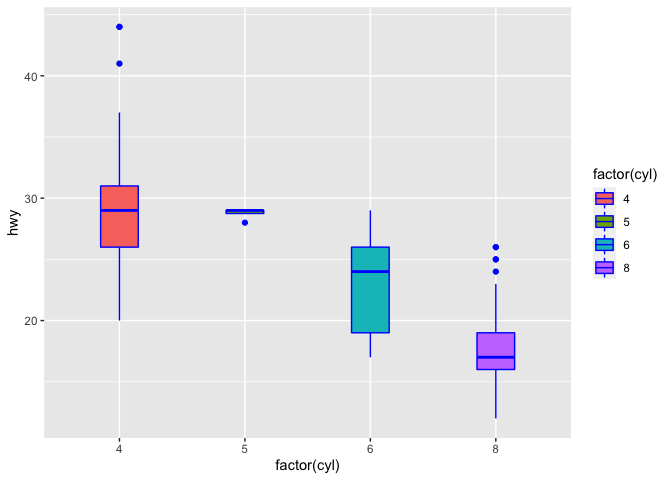
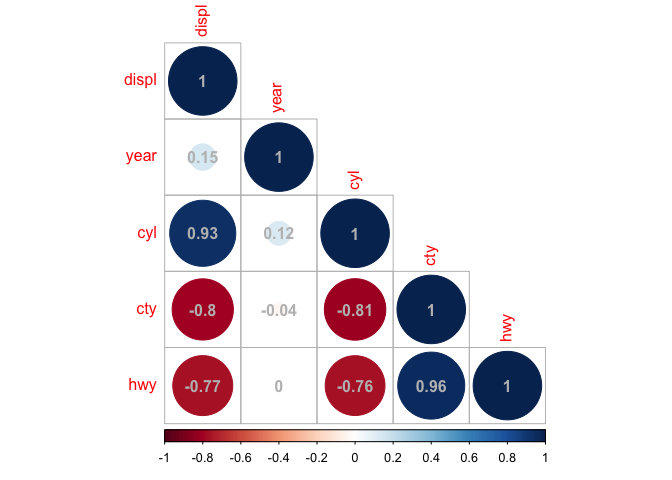

PSTAT 131 HW1
================
Jenny Do (5669841)
April 01, 2022

# Machine Learning Main Ideas

Please answer the following questions. Be sure that your solutions are
clearly marked and that your document is neatly formatted.

You don’t have to rephrase everything in your own words, but if you
quote directly, you should cite whatever materials you use (this can be
as simple as “from the lecture/page \# of book”).

## Question 1:

Define supervised and unsupervised learning. What are the difference(s)
between them?

Supervised learning describes the situation in which for each
observation of the predictor measurement(s) \(x_i, i = 1,...,n\) there
is an associated response measurement \(y_i\).

Unsupervised learning describes the situation in which for every
observation \(i = 1,...,n\), we observe a vector of measurements \(x_i\)
but no associated response \(y_i\)

The differences between supervised and unsupervised learning is

pg 37

## Question 2:

Explain the difference between a regression model and a classification
model, specifically in the context of machine learning.

The dif

## Question 3:

Name two commonly used metrics for regression ML problems. Name two
commonly used metrics for classification ML problems.

## Question 4:

As discussed, statistical models can be used for different purposes.
These purposes can generally be classified into the following three
categories. Provide a brief description of each.

Descriptive models: Descriptive models are chosen to best visually
emphasize a trend in the data.

Inferential models: Inferential models asks the question of “what
features are significant?”. In addition, it aims to test theories,

Predictive models:

(Lecture 2, Slide 7) \#\# Question 5: Predictive models are frequently
used in machine learning, and they can usually be described as either
mechanistic or empirically-driven. Answer the following questions.

Define mechanistic. Define empirically-driven. How do these model types
differ? How are they similar?

In general, is a mechanistic or empirically-driven model easier to
understand? Explain your choice.

Describe how the bias-variance tradeoff is related to the use of
mechanistic or empirically-driven models.

# Exploratory Data Analysis

This section will ask you to complete several exercises. For this
homework assignment, we’ll be working with the mpg data set that is
loaded when you load the tidyverse. Make sure you load the tidyverse and
any other packages you need.

Exploratory data analysis (or EDA) is not based on a specific set of
rules or formulas. It is more of a state of curiosity about data. It’s
an iterative process of:

  - generating questions about data
  - visualize and transform your data as necessary to get answers
  - use what you learned to generate more questions

A couple questions are always useful when you start out. These are “what
variation occurs within the variables,” and “what covariation occurs
between the variables.”

You should use the tidyverse and ggplot2 for these exercises.

``` r
# Load the needed data, mpg data set 
data(mpg)
```

    ## Warning in data(mpg): data set 'mpg' not found

``` r
# Load tidyverse, ggplot2 and corrplot (needed in problem 5)
library(tidyverse)
```

    ## ── Attaching packages ─────────────────────────────────────── tidyverse 1.3.1 ──

    ## ✓ ggplot2 3.3.5     ✓ purrr   0.3.4
    ## ✓ tibble  3.1.6     ✓ dplyr   1.0.8
    ## ✓ tidyr   1.2.0     ✓ stringr 1.4.0
    ## ✓ readr   2.1.2     ✓ forcats 0.5.1

    ## Warning: package 'tidyr' was built under R version 4.0.5

    ## Warning: package 'readr' was built under R version 4.0.5

    ## Warning: package 'dplyr' was built under R version 4.0.5

    ## ── Conflicts ────────────────────────────────────────── tidyverse_conflicts() ──
    ## x dplyr::filter() masks stats::filter()
    ## x dplyr::lag()    masks stats::lag()

``` r
library(ggplot2)
library(corrplot)
```

    ## corrplot 0.92 loaded

## Exercise 1:

We are interested in highway miles per gallon, or the hwy variable.
Create a histogram of this variable. Describe what you see/learn.

``` r
p1<-ggplot(mpg, aes(x=hwy)) + 
  geom_histogram(bins = 30L, color="black", fill="white") + labs(x ="Highway Miles per Gallon", y = "Frequency") + ggtitle("Histogram for Highway Miles per Gallon")
p1
```

<!-- --> \#\#
Exercise 2: Create a scatterplot. Put hwy on the x-axis and cty on the
y-axis. Describe what you notice. Is there a relationship between hwy
and cty? What does this mean?

``` r
p2 <- ggplot(mpg, aes(x=hwy, y=cty)) + geom_point() + labs(x ="Highway Miles per Gallon", y = "City Miles per Gallon") + ggtitle("Scatterplot: Highway Miles vs. City Miles")
p2 
```

<!-- -->

\#\#Exercise 3: Make a bar plot of manufacturer. Flip it so that the
manufacturers are on the y-axis. Order the bars by height. Which
manufacturer produced the most cars? Which produced the least?

``` r
p3 <- ggplot(data = mpg, aes(x=reorder(manufacturer, -table(manufacturer)[manufacturer])))+
  coord_flip()+ geom_bar()+ labs(x ="Car Brand", y = "Count") + ggtitle("Bar Plot of Manufacturer")
p3
```

<!-- --> Answer
Exercise 3: After ordering the bars by height, we can see that
manufacturer Dodge produced the most cars while manufacturer Lincoln
produced the least cars.

## Exercise 4:

Make a box plot of hwy, grouped by cyl. Do you see a pattern? If so,
what?

``` r
p4 <- ggplot(mpg, aes(x = factor(cyl), y = hwy, fill = factor(cyl))) + geom_boxplot(width = 0.3, color = "blue")
p4 
```

<!-- --> \#\#
Exercise 5: Use the corrplot package to make a lower triangle
correlation matrix of the mpg dataset. (Hint: You can find information
on the package here.)

Which variables are positively or negatively correlated with which
others? Do these relationships make sense to you? Are there any that
surprise you?

``` r
# as cor function requires values to be numeric: 
# use subset function to remove all the variables that are not of numeric type 
mpg_drop <- subset(mpg, select = -c(manufacturer, model, trans, drv, fl, class))
# Define corr 
corr_val <- cor(mpg_drop)
# Use the corrplot function to make a lower triangle correlation matrix of mpg
# with variables manufacturer, model, trans, drv, fl, class excluded (all factors)
corrplot(corr_val, type = "lower", addCoef.col ="gray")
```

<!-- -->
Answer(Exercise 5): After using the corrplot package to make a lower
triangle correlation matrix of mpg (with all factor variables excluded),
we note the following: - Correlation coefficients along the diagonal are
all equal to 1. This makes sense because each variable is perfectly
correlated to itself. - Positively correlated: \* The correlation
between variable displ (denoting engine displacement, in litres) and cyl
(denoting number of cylinders) is 0.93, which indicates that they are
strongly positively correlated. More engine displacement means more
cylinders. This makes sense as displacement is the total volume of all
cylinders in an engine. (??)

    engine displacement means an engine can move more air and fuel giving it the potential to make more power. Then the more cylinders an engine possesses, the faster power can be generated.

  - The correlation between variable cty (denoting city miles per
    gallon) and hwy (denoting highway miles per gallon) is 0.96, which
    indicates that they are strongly positively correlated. More city
    miles are strongly related to higher amounts of highway miles. This
    makes sense; there is constant stopping and starting on city roads
    and frequent changes of speeds. If this figure is high, the car
    should have better miles on the highway which has less stopping and
    re-acceleration.

  - Negatively correlated:
    
      - The correlation between variable displ (denoting engine
        displacement, in litres) and cty (denoting city miles per
        gallon) is -0.8, which indicates that they are strongly
        negatively correlated. More engine displacement is associated
        with less city miles. This is makes sense; engine displacement
        means an engine can move more air and fuel giving it the
        potential to make more power. A higher engine displacement
        equates to a higher fuel consumption, meaning less city miles
        per gallon.
      - The correlation between variable displ (denoting engine
        displacement, in litres) and hwy (denoting highway miles per
        gallon) is -0.77, which indicates that they are strongly
        negatively correlated. More engine displacement is associated
        with less highway miles. Similar to the result above, a higher
        engine displacement equates to a higher fuel consumption,
        meaning less highway miles per gallon.

  - The correlation between variable cyl (denoting number of cylinders)
    and cty (denoting city miles per gallon) is -0.81, which indicates
    that they are strongly negatively correlated. More cylinders are
    associated with less city miles. This makes sense; the more
    cylinders an engine has, the faster power can be generated in the
    engine. More cylinders in an engine equates to a higher fuel
    consumption, meaning less city miles per gallon.

  - The correlation between variable cyl (denoting number of cylinders)
    and hwy (denoting highway miles per gallon) is -0.76, which
    indicates that they are strongly negatively correlated. More
    cylinders are associated with less highway miles. Similar to the
    result above, more cylinders in an engine equates to a higher fuel
    consumption, meaning less highway miles per gallon.

  - I find it surprising that engine displacement, number of cylinders,
    city miles per gallon and highway miles per gallon has little to no
    correlation to the year of manufacture.
